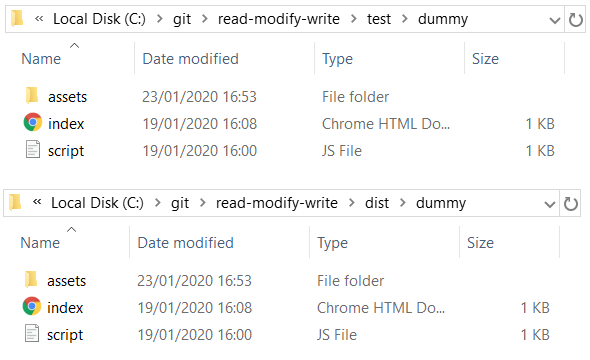

# read-modify-write
NodeJS - Read File, Modify Content, Write to File



## Table of content

1. Introduction to read-modify-write
2. Read File/Directory
3. Write to File/Directory
4. Filter files
5. Modify Content
6. Prepare for Production
7. Run tests

### 1. Introduction to read-modify-write

This Node module provides an API to interact with the file system and perform recursive sequential IO operations (such as file reading/writing and file content modification). It executes all operations in a blocking and synchronous way. It is a very simple yet very flexible toolkit with size of less than 2KB and no dependencies.
To use the library all we need is to import read-modify-write module into our code.

```js
const rmw = require('read-modify-write');
```

### 2. Read File/Directory

To read file content recursively in a chosen directory we simply need to pass the folder path as the first parameter to the already imported module:

```js
rmw('src/dummy');
```

### 3. Write to File/Directory

To copy files from one directory to another we need a path modifier function which is passed as a second parameter:

```js
const move = filePath => filePath.replace('src', 'dist');
rmw('src/dummy', move);
```

The path modifier function takes one parameter which is the location / path for each of the listed files. The code above copies all files in the 'src/dummy' folder to the 'dist/dummy'.

### 4. Filter files

To filter files with certain extension we need to supply a function that will be called on each files on the list, and only return the values that pass a specific test (in this case the file extension is present in the string):

```js
const move = filePath => filePath.replace('src', 'dist');
const filterHtml = c => c.endsWith('.html');
rmw('src/dummy', move, filterHtml);
```

This function, in combination with the previous one can be used to add suffix for certain file types:

```js
const move = filePath => filePath.replace('.js', '.min.js');
const filterJs = c => c.endsWith('.js');
rmw('src/dummy', move, filterJs);
```

### 5. Modify files

Consider an html file in 'src' folder with the following content:

```html
<html lang="en"><head><meta charset="utf-8"><title></title></head></html>
```

To update the file content and save it to a new location we need to pass a forth parameter which is an update function which accepts file content as an argument.

```js
const move = filePath => filePath.replace('src', 'dist');
const filterHtml = c => c.endsWith('.html');
const update = c => c.replace('<title></title>', '<title>Page title</title>');
rmw('src/dummy', move, filterHtml, update);
```

The code above will result in a new html file created in the 'dist/dummy' folder with the following content:

```html
<html lang="en"><head><meta charset="utf-8"><title></title></head></html>
```

### 6. Prepare for production

This toolkit can assist you automate painful or time-consuming tasks in your development workflow. For example when publishing to  production it can help you by doing CSS preprocessing, JS transpiling, minification, and much more:

```js
const terser = require('terser');
const cleanCss = require('clean-css');
const uglify = c => terser.minify(c).then(({ code }) => code);
const clean = c => new cleanCss().minify(c).styles;
const move = filePath => filePath.replace('src', 'dist');
const filterJs = c => c.endsWith('.js');
const filterCss = c => c.endsWith('.css');
rmw('src', move);s
rmw('src/dummy', move, filterJs, uglify);
rmw('src/dummy', move, filterCss, clean);
```

### 7. Running tests

Running and reviewing unit tests is a great way to get familiarized with a library and its API. You can run the tests the following command:

```sh
$ npm test
```
